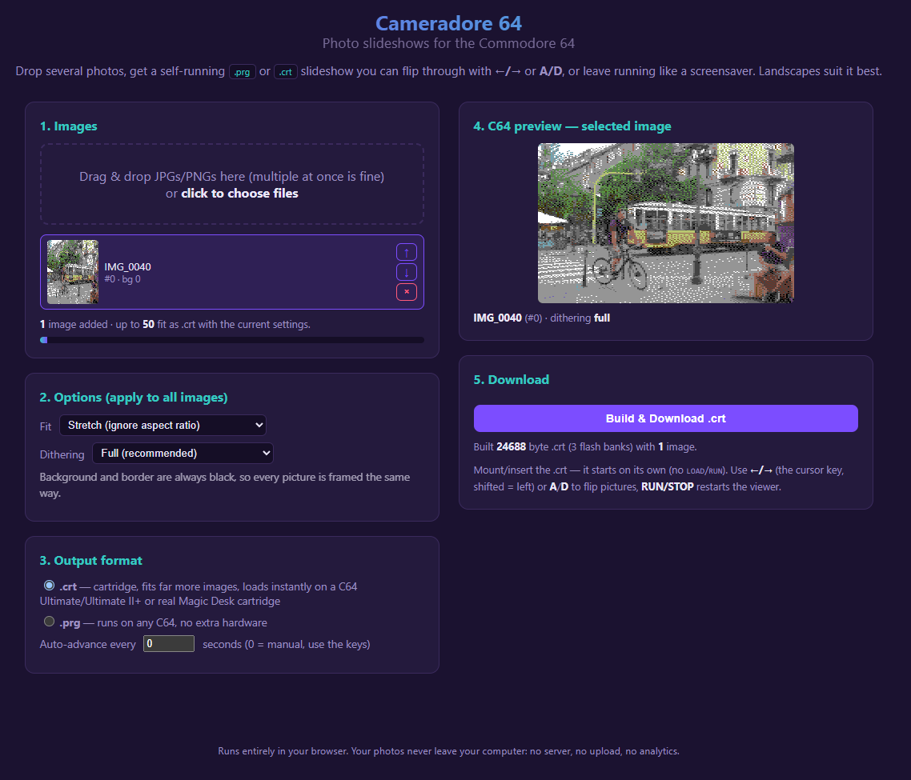

# Cameradore 64

Turn photos into a slideshow that runs on a real Commodore 64.

Drop some JPGs into the page, pick a format, and out comes a file you can put
straight onto a C64: either a `.prg` you load from disk, or a `.crt` cartridge
image that boots the instant you switch the machine on.

Your photos never leave your computer. There is no server, no upload, no
account, no analytics, nothing phoning home. The conversion runs in your
browser on the file you dropped in, and the whole tool is a single HTML file
you can save and open with your network switched off if you want to watch it
work anyway.

## Using it

Open `cameradore64.html` in a browser. Drag your photos in, choose `.prg` or
`.crt`, download.

Then on the C64:

- **`.crt`** is the good one. On an Ultimate 64 or Ultimate II+ you can drop
  it straight into the machine's web interface from a browser on the same
  network, or put it on the SD card, or write it to a real Magic Desk style
  cartridge. Whichever way, select it and the machine resets into the
  slideshow immediately. No loading, no waiting.
- **`.prg`** works on any stock C64 with no extra hardware at all.
  `LOAD"NAME",8,1` then `RUN`.

Flip through pictures with `A` and `D`, or the cursor keys with shift to go
backwards. `RUN/STOP` gets you out. There is an autoplay timer too, if you
want to leave it running as a screensaver.

Tested on real hardware, not just in an emulator.

## Landscapes are what it's best at

Wide outdoor shots come out looking like the painted backdrops from an old
Sierra adventure game. 

The C64 carves the screen into 4x8 blocks and gives each block three colors
plus one shared background. Big coherent shapes survive that. Fine detail does
not. A landscape is mostly big coherent shapes: sky, treeline, water, the line
of a ridge. Skies do particularly well, because a smooth gradient is exactly
what dithering between two well chosen colors is best at.

Sierra's artists were solving the same problem on 16 color EGA, which is why
the results match.

Portraits work, but they are the hard case. Faces sit in a narrow band of
similar tones where small shifts read as wrong, and the detail that makes
someone recognizable is smaller than one block.

## How many pictures fit

About 50 on a `.crt`, about 4 on a `.prg`.

The cartridge wins because it can bank switch its way through 512K of flash.
The `.prg` has to survive in whatever RAM is going spare around BASIC and the
KERNAL, which is not much.

## Options

**Dithering** trades exact color for apparent detail. Full is the default and
is usually what you want. Turn it down or off for graphic, poster-like images
with large flat areas, where the texture just reads as noise.

**Fit** decides what happens when your photo is not 4:5. Stretch fills the
screen and distorts slightly, cover crops to fill, contain letterboxes the
whole frame.

Background and border are always black, so every picture is framed the same
way and nothing flashes between slides.

## It stays on your machine

Worth saying twice, because photo tools usually do the opposite.

There is no backend. The page does not make a single network request once it
is loaded, so nothing is uploaded, nothing is stored, and nothing is logged.
Your pictures are read by the browser, converted in memory, and handed back to
you as a download.

If you want to be sure rather than take my word for it: save the HTML file,
disconnect from the network, and use it exactly as before. It is one file with
no dependencies, so there is nothing else to audit.

## Under the hood

Multicolor bitmap mode, 160x200, VIC bank 1. Both output formats share one
slideshow driver written in 6502 assembly, assembled by a small assembler that
lives in the same HTML file.

Choosing colors is the whole game. Each 4x8 block gets three of the sixteen
available, so the converter tries every possible combination for every block
and keeps whichever reproduces that block most closely, comparing colors in
CIE Lab so the choices match what the eye actually sees rather than what looks
close arithmetically.

The driver was built against a 6502 simulator that actually executes the
generated machine code and checks where every byte lands, rather than by
guessing and squinting at a screen. That matters more than it sounds for a
cartridge, which takes over before the KERNAL has set anything up and has to
do all that groundwork itself.
